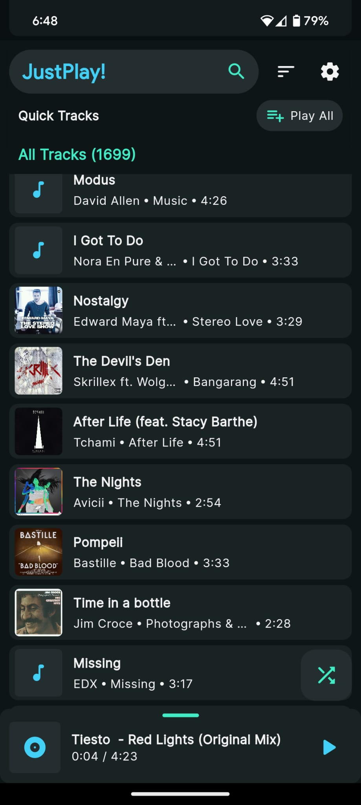
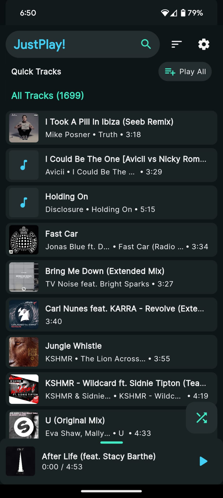
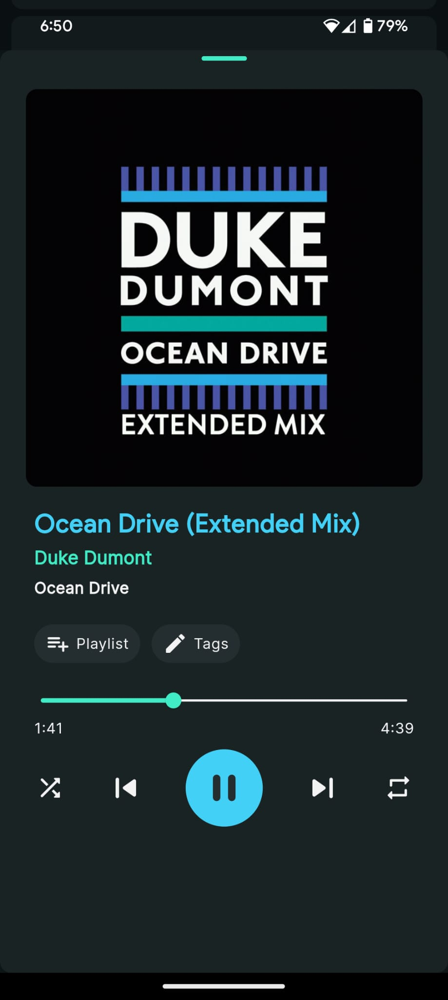
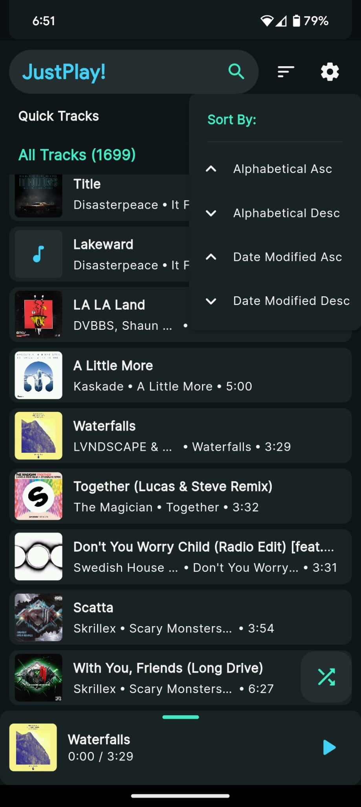
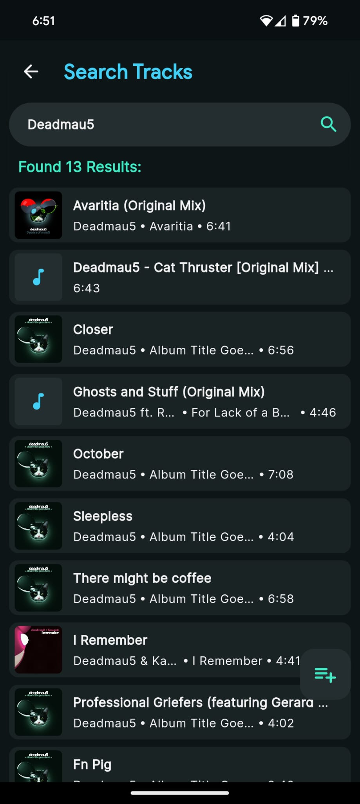

# 🎵 JustPlay!  

JustPlay! is a sleek and feature-rich music player app for local music files, with a stunning user interface, built to deliver a seamless audio playback experience.

Primarily oriented for quick playback of local music libraries without any ads or cluttered UI for files without appropriate metadata. Planned features like a truly random shuffle play, notification playback controls, playlists management and exporting, editing metadata, tags and much more in progress.

### Tech Stack 🛠️  
+ Flutter framework with packages:  
+ State Management: [provider](https://pub.dev/packages/provider)  
+ On-device Database: [objectbox](https://pub.dev/packages/objectbox)  
+ Cache Storage & Preferences: [shared_preferences](https://pub.dev/packages/shared_preferences)  
+ Audio Metadata Handling: [audiotags](https://pub.dev/packages/audiotags)  
+ Audio Player: [just_audio](https://pub.dev/packages/just_audio)  
+ Permissions Management: [permission_handler](https://pub.dev/packages/permission_handler), [device_info_plus](https://pub.dev/packages/device_info_plus)  
+ File Management: [file_picker](https://pub.dev/packages/file_picker)    

### Screenshots 📸
  
  
  
  
  

Stay tuned for more features and improvements! 🚀  
